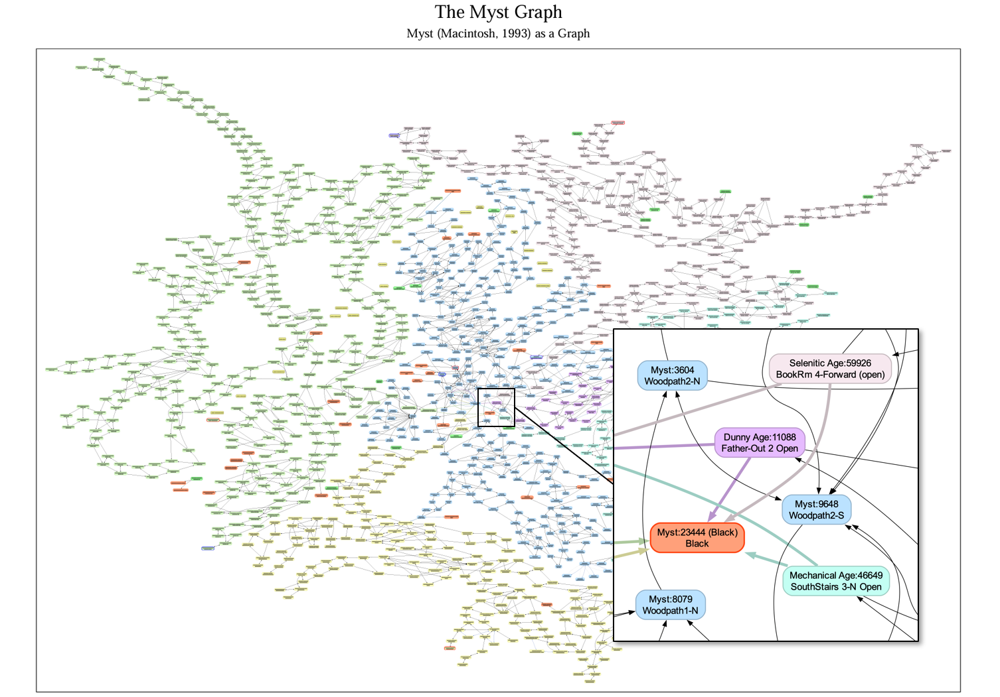

# DeMystify

DeMystify is an unofficial open-source project graph-based analysis of the classic Myst game. In other words, it represents Myst as a graph.

**Please note that the graph generator, written in Go, has not been released yet; it will be released in this repository on Sunday, May 11, 2025. Contributions will be welcomed!**

## The Myst Graph

The Myst Graph represents the relationships between the game's cards. It features 1,364 nodes and 3,189 directed or bidirectional edges, shedding light on the game's complex structure.

## Analysis and Insights

Our analysis explores various aspects of the graph, including path analysis, cluster formation, and node properties. We will continue to update and refine our findings through regular blog posts.

## Stay Up-to-Date

For in-depth articles and updates on DeMystify, visit our blog series on [glthr.com](https://glthr.com):

* [The Myst Graph: A New Perspective on Myst](https://glthr.com/myst-graph-1)
* [The Myst Graph, 2: Revealing New Findings](https://glthr.com/myst-graph-2)
* [The Myst Graph, 3: Generating the Graph with DeMystify](https://glthr.com/myst-graph-3) *[will be published on May 11, 2025]*

## Disclaimer

This project is a personal initiative to analyze and understand the classic Myst game. It is an unofficial and nonlucrative open-source effort created for educational purposes only. This project is not affiliated with Cyan Worlds or the original creators of Myst.

## License and Credits

DeMystify is released under the MIT License, acknowledging the original creators of Myst and Cyan Worlds for inspiring this project.